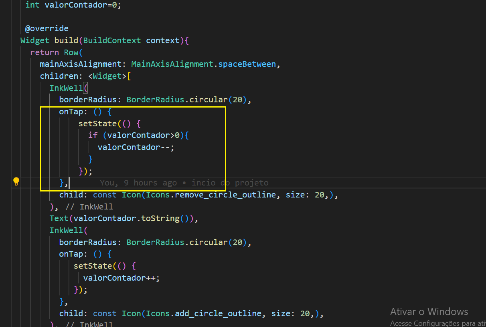

# Gerenciando estados com Provider

Este projeto é fruto do curso de 'Flutter: aplicando gerenciamento de estados com MobX' da plataforma ALURA

## Introdução

  Dado aplicativo um aplicativo de delivery chamado Panucci Delivery, com layout pronto, será dada continuidade nas ações adicionar itens na sacola de compras e conferir o valor total na parte inferior da tela. Clicando no botão "Ver carrinho", seremoss redirecionados para a página de checkout, onde é possível validar os itens escolhidos e finalizar o pedido.

  Utilizaremos o gerenciador de estados MobX. Estudaremos conceitos como actions e observables (observáveis). Também aprendemos como recuperar as informações dos observáveis e transportá-los para toda nossa aplicação, utilizando provider.

## Ferramentas utilizadas

 - mobx: É uma biblioteca de gerenciamento de estado para Dart que permite que se crie stores para gerenciar o estado da aplicação de forma reativa, facilitando a comunicação entre os componentes da UI e o estado da aplicação. Com MobX, quando o estado é atualizado, todos os componentes que dependem desse estado são automaticamente re-renderizados.

- flutter_mobx: É o pacote que integra o MobX com o Flutter, fornecendo widgets e funcionalidades que permitem a reatividade do MobX dentro dos aplicativos Flutter. Ele oferece, por exemplo, o widget Observer, que é usado para observar as mudanças nos stores MobX e reconstruir automaticamente a UI quando o estado observado muda.

- provider: Biblioteca de gerenciamento de estado para Flutter, recomendada pela equipe do Flutter. Ela funciona com um mecanismo diferente do MobX, baseado em InheritedWidgets, para passar dados e gerenciar o estado através da árvore de widgets. O Provider é mais genérico e pode ser usado para injeção de dependência, além de gerenciamento de estado. Ele não é específico para MobX e pode ser usado com qualquer abordagem de gerenciamento de estado ou mesmo sem uma.

- mobx_codegen: Este pacote é uma parte importante do ecossistema MobX em Dart/Flutter, pois fornece a capacidade de user anotações em seu código com @observable, @action, @computed, etc., e o pacote gerará automaticamente o código boilerplate necessário para que essas anotações funcionem.  

- build_runner: Não é específico para MobX, mas é uma ferramenta essencial quando se usa mobx_codegen ou qualquer outra biblioteca que requer geração de código em Dart. build_runner é uma ferramenta que automatiza o processo de geração de código, compilando o código fonte Dart, incluindo o código gerado por mobx_codegen. Você o executa a partir da linha de comando para gerar o código necessário para suas anotações MobX, bem como para outras tarefas de geração de código que possam ser necessárias em seu projeto Flutter.

## Implementação do contador interno dos cartões

 A titulo de experimento, dentro de 'contador.dart' foi implemetado o controle de estado 'setState()',  juntamente com uma variavel de controle 'valorContador' em cada evento 'onTap' porem isso não vai atender já que precisamos dessa informação centralizada para atender outros widgets então começamos com o ModX.

obs: usando o mobx não é necessário a alteração do 'StatelessWidget' para o 'StatefulWidget' devido ao 'setState', pois não  mais necessário, usaremos uma instancia da classe mobx.

- uso do setState()

- uso da classe mobX 

- classe itemStore mobX 

### veja aqui o processo de conversão de classes para mobX

- Primeiramente é necessário se escrever a classe com a sintaxe especifica

- depois é necessário geração da classe mobx através da linha de comando 'flutter pub run build_runner watch'

- mais informações no link abaixo

https://pub.dev/packages/mobx

### adicionando contador de itens
 
- Criada a classe 'ItemStore()', essa será adaptada  a classe 'Contador()', que retorna o widget (Row)com sinais '+', 'valor', '-' utilizada no cartão (Cart)

obs: necessário envolver o widget retornado(Row()) com a classe 'Observer' para que o mobX atualize o valor

- Agora que foi implementado o contador dos cartões utilizando o mobX,teremos tambem uma classe mobx para 'CarrinhoStore()' que será utilizada em Home() assim como em Contador() já que ela será responsavél pela atualização do carrinho
através do uso do 'provider'.

  Esse provider será acionado apartir de Main()

  - CarrinhoStore()

  

  - Main()

  

  - Contador()

  

  - Home()

   

  - App()

   

### Modificando carrinho para usar lista

- Adaptação de CarrinhoStore() para trabalhar diretamente com array de item (listaItem)
obs: adoção da classe 'ObservableList' para permitir que o lenght do array seja usado em Home()  

 

- Adaptação da classe Cartao() onde será passado um paramtro item para Contador()

 

- Adaptação da classe Contador() para que receba item como parametro e passe para os metodos da classe 'carrinhoStore'

 

- Adaptação da classe Home() para que utilize a propriedade 'lenght' do array 'listItem'

 